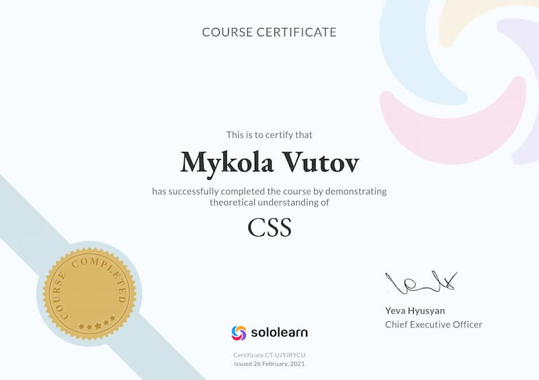

<!-- AUTOGEN:STATS -->
      

<!-- END:AUTOGEN -->

## Мої досягнення

 

## Мої сертифікати - Пройшов курс на Sololearn :

[SOLOLEARN](https://www.sololearn.com/certificates/CT-UJ9JRYCU)

## 📌 Завдання

- Створити репозиторій **goit-markup-hw-05**.  
- Склонуй попередню роботу і додай нові файли.  
- Виконати розмітку та оформлення форм та модального вікна згідно макета **HW#5**.  
- Налаштувати **GitHub Pages** та додати посилання на живу сторінку у секцію **About**.

🔗 [Жива сторінка](https://vuTov-mykola.github.io/goit-markup-hw-05/)

---

## ✅ Критерії прийому

### **Проєкт**
- `A1` Всі стилі у файлі `css/styles.css`.  
- `A2` Код відформатований за допомогою **Prettier**.  
- `A3` Зображення і текст взяті з макета.  
- `A4` Підключено **modern-normalize**.  
- `A5` Код відповідає настанові.

### **Модальне вікно**
- `B1` Є розмітка та стилі для бекдропа.  
- `B2` Бекдроп займає 100% в'юпорту і фіксований.  
- `B3` Є розмітка та стилі модального вікна.  
- `B4` Модальне вікно центроване у бекдропі.  
- `B5` Кнопка закриття у правому верхньому куті.  
- `B6` Спочатку приховано бекдроп і модальне вікно.  
- `B7` Клас `is-open` показує бекдроп і модалку.

### **Форми**
- `C1` HTML-розмітка всіх елементів з макета.  
- `C2` Семантичні теги.  
- `C3` Форма підписки у футері.  
- `C4` Форма заявки у модальному вікні.  
- `C5` Усі інпути мають атрибут `name`.  
- `C6` Значення `name` описові.  
- `C7` Кожен інпут має `<label>`.  
- `C8` Є `placeholder`, якщо є у макеті.  
- `C9` Кнопки відправлення мають `type="submit"`.  
- `C10` Іконки форм у `icons.svg`.

### **Оформлення**
- `D1` Стилі форми підписки у футері.  
- `D2` Стилі форми заявки у модальному вікні.  
- `D3` При `focus` змінюється рамка і іконка.  
- `D4` Оригінальний чекбокс приховано.  
- `D5` Кастомний чекбокс реалізовано через SVG.  
- `D6` Для ефектів hover/focus додані переходи (`250ms`, `cubic-bezier(0.4,0,0.2,1)`).

---
